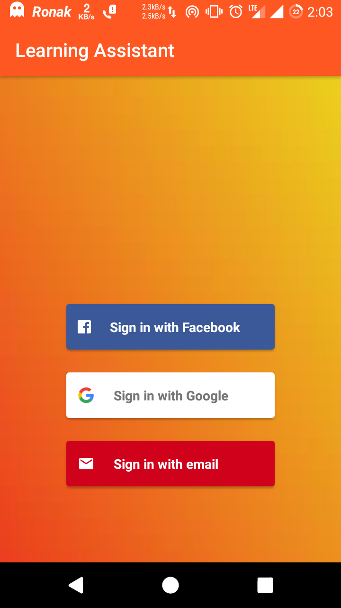
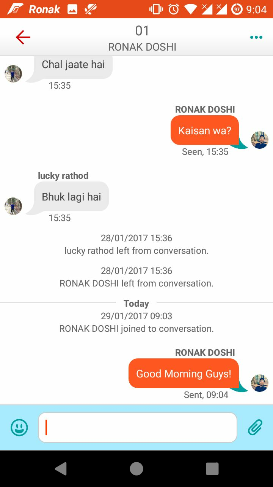
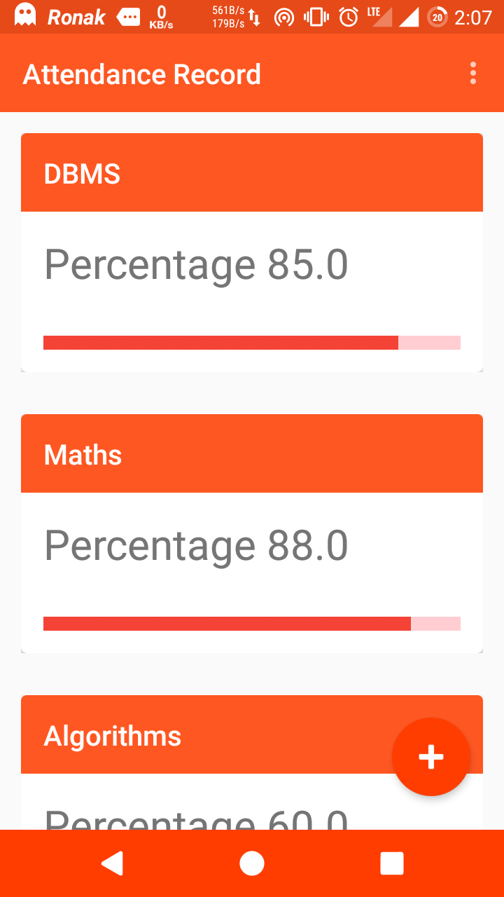
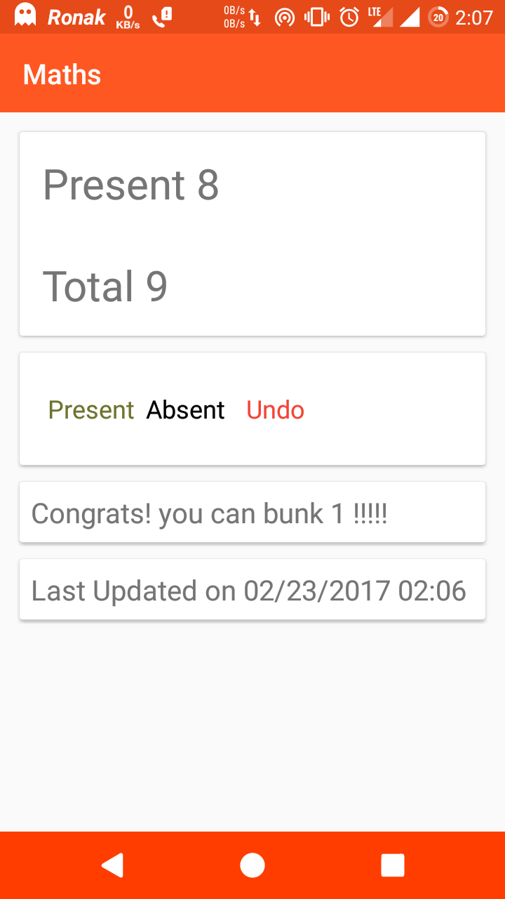
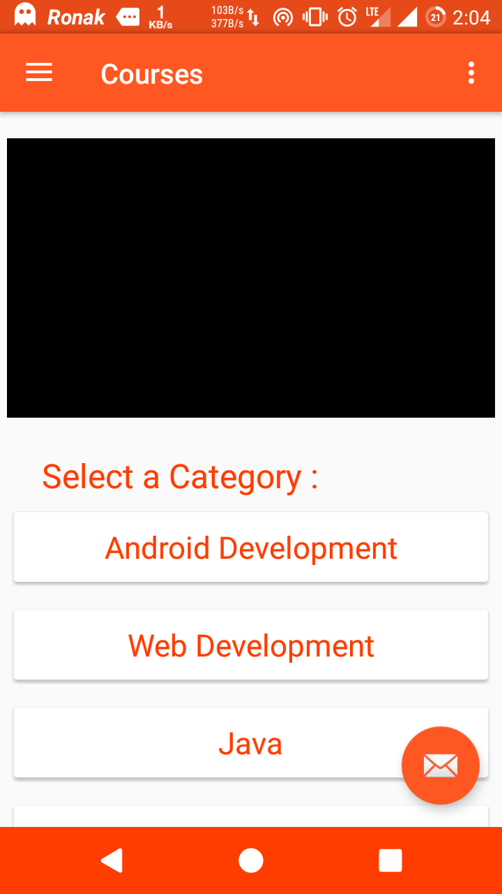
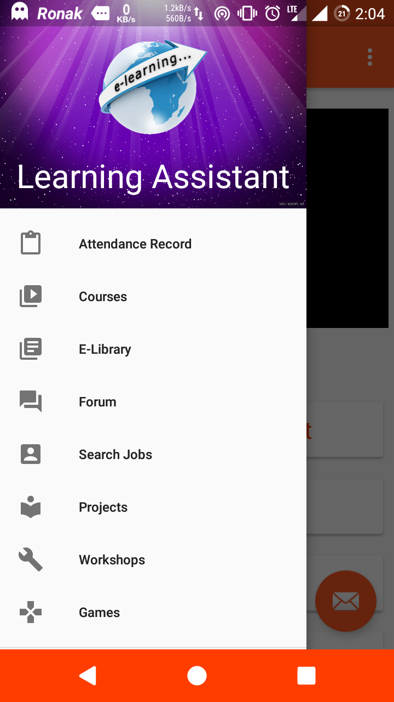

# Learning_Assistant

A material design Android App for College Students developed as a part of I_Hack Hackathon during E-Summit 2017 at IIT-Bombay

<b>Features : </b>

 <b> # Authentication </b>
  
    

<b>  # Chat Rooms - Group/Intra-department discussions room (Real-time) </b>
 
</img>
  
<b>  # Attendance Manager </b>
 

   

 <b> # Video Lectures </b>
  

<b>  # Events </b>
 
    

<b>  # Discussion Forum </b>
   
 
<b>  # Projects Library </b>
    
 
<b>  # And many more... </b>
 

