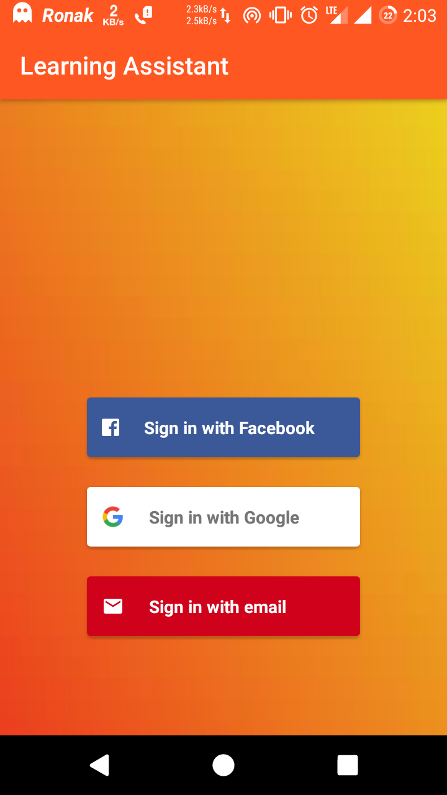
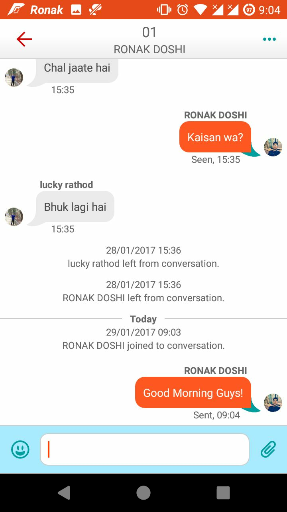
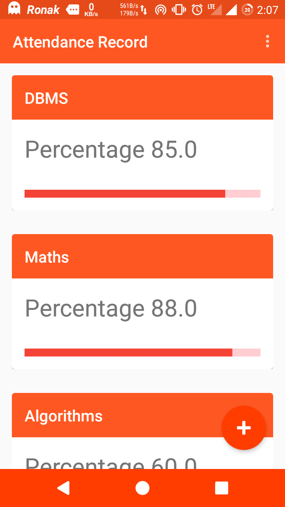
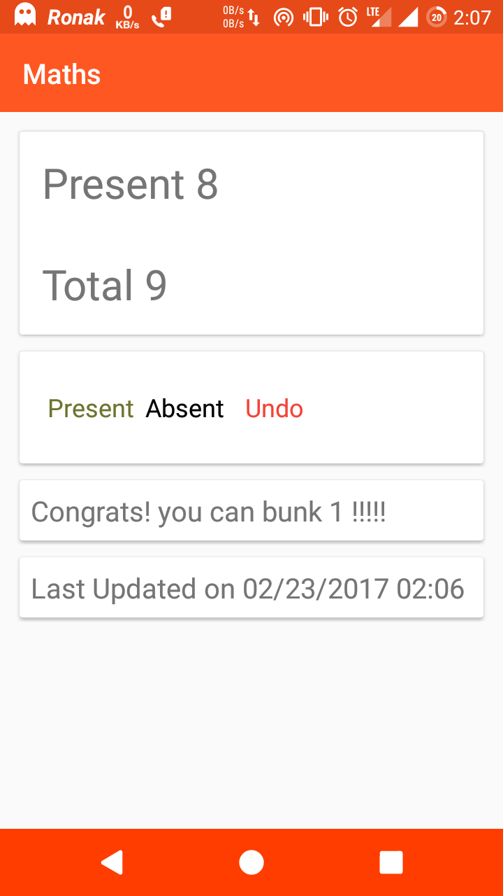
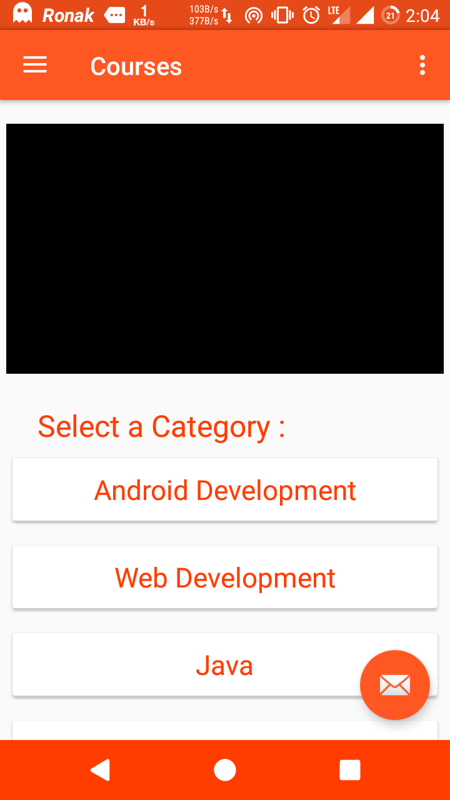
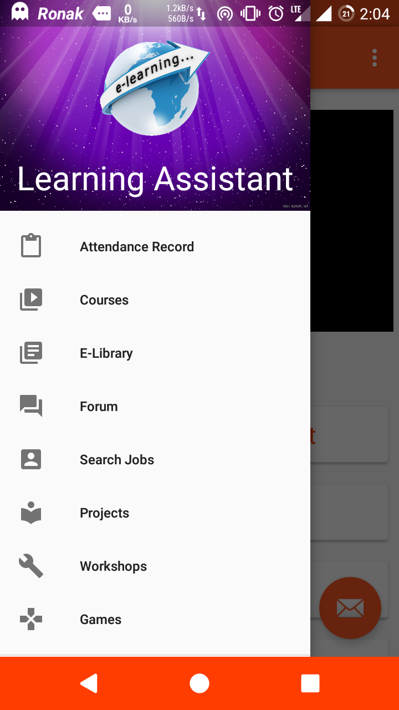

# Learning_Assistant

Android App “Learning Assistant” for College Students providing “Real-Time Chat System, Attendance Manager, Projects, E-Library, Online Video Tutorials, etc. as well as an Web application hosting an E-Library and an Exam Scheduler Bot. This Project was developed as a part of IIT Bombay's E-Summit 2017 : I_Hack Hackathon.

Key Features : 
# Smart Authentication
# Real-Time Chat System
# Attendance Manager
# E-Library
# Projects
# Video-Tutorials
# And many more.. 

<b>Features : </b>

 <b> # Authentication </b>
  
    

<b>  # Chat Rooms - Group/Intra-department discussions room (Real-time) </b>
 
</img>
  
<b>  # Attendance Manager </b>
 

   

 <b> # Video Lectures </b>
  

<b>  # Events </b>
 
    

<b>  # Discussion Forum </b>
   
 
<b>  # Projects Library </b>
    
 
<b>  # And many more... </b>
 

